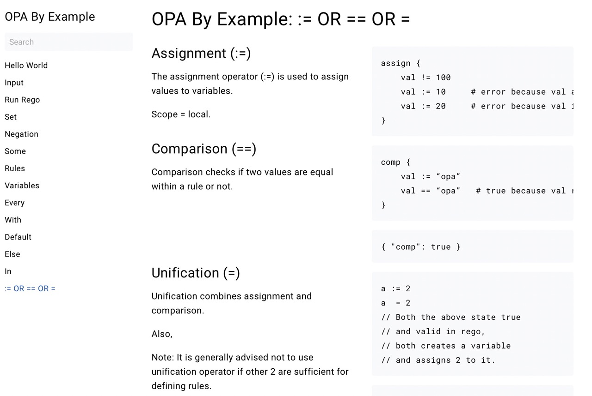
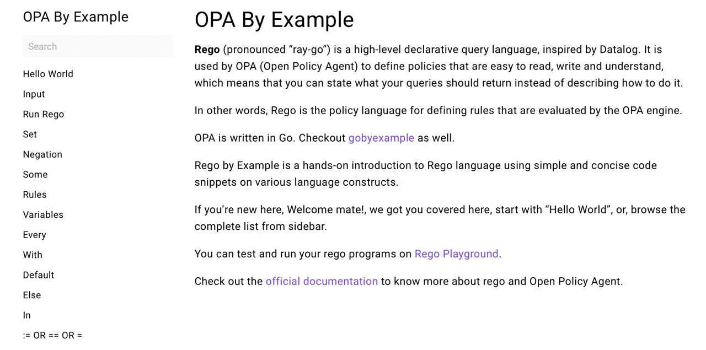

# opabyexample
Open Policy Agent (OPA) Tutorial Inspired By GoByExample.com

Rego is the declarative language used by OPA to enforce rules.

This site is hosted on a Hugo theme.

Look at these screenshots to get a brief idea about the site overall look and . 






## How to add new page to the site?
1. Add a new .md file to the ```/content/docs``` folder
2. Include 'Title', 'weight' and 'type' in the top section of the .md file
3. For more configuration refer [theme docs](https://themes.gohugo.io/themes/hugo-book/)
